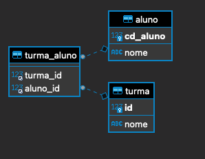

## MySql e Dart (Uma conxão Simples)
O objetivo deste trabalho é realizar uma conexão em um banco de dados mysql com o dart.

### 01 - ER Diagrama



### 02 - Acesso ao Banco de dados
Alguns exemplos de Insert, Update e Select na base de dados. 


### 03 - Banco de dados
Utilizamos o docker e não instalamos localmente o MySql. No diretório onde clonar a aplicação digite:

```
docker-compose up
```
